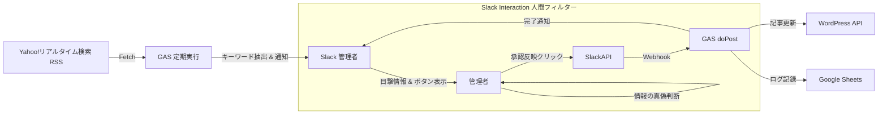

# シールマニア システム設計書 (GAS + Slack版) Rev.2

## 1. システム概要
**プロジェクト名:** シールマニア (Seal Mania) 在庫管理ボット
**目的:** 人気シール（ボンボンドロップ等）のX（旧Twitter）上での目撃情報を収集し、Slack経由の管理者承認（人間フィルター）を経て、WordPressサイトへ即時反映させる。
**技術スタック:**
* **Backend:** Google Apps Script (GAS)
* **Database:** Google Sheets (監視リスト & 状態管理)
* **Interface:** Slack (通知・承認ボタン・結果表示)
* **CMS:** WordPress (REST API + ACF)
* **Source:** Yahoo!リアルタイム検索 (RSS)

---

## 2. システムアーキテクチャ



---

## 3. 機能要件

### 3.1. 収集・監視機能 (Collector)

* **トリガー:** 15分〜30分ごとに定期実行（情報の鮮度重視）。
* **対象:** Googleスプレッドシートに登録された「Yahoo!リアルタイム検索のRSS URL」。
* **検索条件例:** `"ボンボンドロップ" ("入荷" OR "あった" OR "買えた") -通販 -譲 -求`


* **処理:** `UrlFetchApp` でRSS XMLを取得し、`XmlService` でパースして最新の投稿データを抽出する。

### 3.2. 判断・解析機能 (Analyzer)

* **目的:** どの店舗の情報かを推測し、管理者の判断を助ける。
* **ロジック:** 投稿テキスト内に、スプレッドシートに登録された「店舗名キーワード」が含まれるかチェックする。
* 例: テキストに「大宮」と「ハンズ」が含まれる → `hands-omiya` の情報と推測。


* **通知条件:** RSSの最新投稿日時が、前回のチェック日時より新しい場合のみ通知する。

### 3.3. 通知・承認機能 (Notifier & Approver)

* **プラットフォーム:** Slack
* **UI:** Block Kitを使用し、以下の情報を表示する。
* **抽出店舗:** ハンズ 大宮店（推測）
* **投稿内容:** "大宮のハンズにボンボンドロップあった！残り少ないかも"
* **元ツイート:** [Link] (クリックして確認用)
* **[◎ 在庫ありとして反映]** ボタン（緑色）
* **[△ 残りわずかとして反映]** ボタン（黄色）
* **[× 在庫なしとして反映]** ボタン（赤色）
* **[却下(無視)]** ボタン（グレー）


### 3.4. 反映機能 (Updater)

* **トリガー:** Slackで「反映」系ボタンが押された時。
* **処理:**
1. WordPress REST API (`/wp-json/wp/v2/store_data/{id}`) を叩き、ACFフィールドを更新する。
2. Googleスプレッドシートの「前回ステータス」を最新化する。
3. Slackのメッセージを「✅ 反映完了: {ステータス}」に上書き更新する。


---

## 4. データ設計

### 4.1. Googleスプレッドシート (StoreMaster)

監視する「店舗」と「検知用キーワード」のマスタ。

| 列 | 項目名 | 説明 | 例 |
| --- | --- | --- | --- |
| **A** | **ID** | システム管理ID | `hands-omiya` |
| **B** | **Store Name** | 表示用店舗名 | `ハンズ 大宮店` |
| **C** | **Keywords** | 検知用キーワード(カンマ区切り) | `大宮,ハンズ` |
| **D** | **Last Status** | 現在のステータス | `×` |
| **E** | **WP Post ID** | WordPress記事ID | `101` |

### 4.2. Googleスプレッドシート (SearchConfigs)

監視する「Yahoo検索条件」のリスト。

| 列 | 項目名 | 説明 | 例 |
| --- | --- | --- | --- |
| **A** | **Search Name** | 管理用名称 | `ボンボンドロップ全般` |
| **B** | **RSS URL** | Yahooリアルタイム検索のRSS | `https://search.yahoo.co.jp/...` |
| **C** | **Last PubDate** | 最後に取得した記事の日時 | `Thu, 29 Dec 2025...` |

### 4.3. Slack Payload (ボタン埋め込みデータ)

```json
{
  "action": "update_wp",
  "wpId": 101,
  "storeName": "ハンズ 大宮店",
  "status": "◎"  // ボタンによって "◎", "△", "×" が入る
}

```

---

## 5. 詳細フローチャート

### A. 定期監視フロー (main.gs)

1. シート `SearchConfigs` からRSS URLを取得。
2. RSSをフェッチし、`Last PubDate` より新しい投稿のみ抽出。
3. 各投稿について:
* シート `StoreMaster` の全店舗キーワードと照合。
* キーワードがヒットした場合（例: "大宮" & "ハンズ"）、その店舗の候補としてSlack通知を作成。
* `sendSlackApproval()` を実行。


4. シートの `Last PubDate` を更新。

### B. 承認実行フロー (doPost)

1. 管理者がSlack通知を見て、元ツイートを確認（人間フィルター）。
2. 正しければ「在庫あり」などのボタンを押す。
3. GASがリクエストを受け取り:
* WordPress APIを更新。
* シート `StoreMaster` のステータスを更新。
* Slackメッセージを「完了」にする。


---

## 6. セキュリティ・環境設定

*(変更なし)*

* **GAS スクリプトプロパティ:** `SLACK_WEBHOOK_URL`, `WP_API_URL`, `WP_USER`, `WP_APP_PASSWORD`
* **デプロイ設定:** 実行ユーザー「自分」、アクセス「全員」

---

## 7. 実装ステップ (改訂版)

1. **WordPress準備:**
* ACF設定、テスト記事作成。


2. **スプレッドシート準備:**
* `StoreMaster` シート作成（店舗とキーワード定義）。
* `SearchConfigs` シート作成（Yahoo検索RSS登録）。


3. **Slack App作成:**
* Interactivity有効化。


4. **GASコーディング (RSS解析):**
* `XmlService` を使ってRSSから記事をループ処理するロジック実装。


5. **GASコーディング (キーワードマッチング):**
* ツイート文言から店舗IDを特定するロジック実装。


6. **GASコーディング (通知 & Webhook):**
* 3種類のステータスボタン付きメッセージ送信機能の実装。
* `doPost` での更新処理実装。


7. **運用テスト:**
* 自分でツイートしてみる → 通知が来る → ボタンでサイト更新 → 成功確認。


```

```