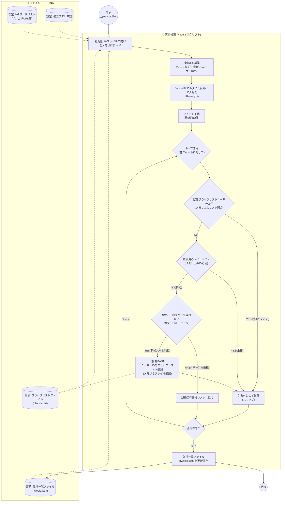

# 実装仕様書：在庫情報スクレイピング・フィルタリング処理

**対象モジュール:** スクレイピングエンジン (`scraper-worker`)

**実行環境:** Node.js (v18+) on AWS (Lambda or EC2)

**トリガー:** 15分間隔 (EventBridge Scheduler / Cron)

## 1. 処理フロー概要
本システムは、Yahoo!リアルタイム検索から在庫に関するユーザー投稿を収集し、スパムやノイズを除去した上でデータベース（JSONファイル）に蓄積する。

### 処理フロー図


---

## 2. ディレクトリ構成とファイル役割

MVPのため、RDBは使用せずローカルファイル（JSON/TXT）で管理する構成とする。

```text
/inventory-scraper
│
├── config/
│   ├── queries.json      # 検索対象キーワード（例: ["店舗名 入荷", "商品名 在庫"]）
│   └── ng_words.json     # NGワード設定（例: ["mercari.com", "招待コード", "相互フォロー"]）
│
├── data/
│   ├── blacklist.txt     # 自動BANされたユーザーIDリスト（改行区切り）
│   └── tweets.json       # 取得済みツイートの蓄積データ
│
├── src/
│   ├── index.js          # メイン実行ファイル
│   ├── scraper.js        # Playwrightによるブラウザ操作・DOM解析
│   ├── filters.js        # 判定ロジック（公式判定、NGワード、ブラックリスト）
│   └── fileManager.js    # ファイルの読み書き操作
│
└── package.json

```

---

## 3. 実装詳細

### 3.1 初期化・データロード (`Init`)

* `fs` モジュールを使用し、`data/` および `config/` 内のファイルを同期的に読み込む。
* `blacklist.txt` は `Set` オブジェクトに展開し、高速な検索（O(1)）を可能にする。
* `tweets.json` から過去のツイートIDのみを抽出し、`Set` (Duplicate Check用) を作成する。

### 3.2 URL構築 (`BuildURL`)

Yahoo!リアルタイム検索のURLパラメータを構築する。

* **Base URL:** `https://search.yahoo.co.jp/realtime/search`
* **Query Parameters (`p`):**
* 検索キーワード（OR条件で結合等はYahooの仕様に合わせる）
* *(Option)* 直近で激しくスパムを行っているユーザーIDが特定できている場合のみ、`-ID:xxxxx` を付与する。
* **注意:** URL長制限があるため、すべてのブラックリストユーザーをURLで除外することはせず、後続のフィルタリング処理に委ねる。


* **Sort:** 最新順 (`ei=UTF-8&mtype=image` など必要に応じて指定)

### 3.3 スクレイピング (`AccessYahoo` & `Extract`)

**使用ライブラリ:** `Playwright`

1. **ブラウザ起動:** ヘッドレスモード (`headless: true`)。
2. **Wait処理:** ページ遷移後、タイムライン要素が表示されるまで `page.waitForSelector()` で待機する。
3. **DOM解析:**
* ツイートコンテナ（例: `.div.Tweet_body` 等）を取得。
* 各要素から以下を抽出する：
* `tweetId` (一意なID)
* `userId` / `userName` (投稿者情報)
* `text` (本文)
* `timestamp` (投稿時間)
* `isOfficial` (公式バッジの有無)
* `urls` (投稿に含まれるリンク一覧)


### 3.4 フィルタリングロジック (`Loop` & `Check`)

抽出した各ツイートオブジェクトに対して、以下の順序で判定を行う。

1. **CheckOfficial (特例判定)**
* 公式バッジがある、または事前に定義した `official_accounts` リストに含まれるIDであれば、**無条件で保存候補 (`Keep`)** とする。


2. **CheckBL (ブラックリスト判定)**
* `userId` が `blacklist` Setに含まれている場合、**即時破棄 (`Discard`)**。


3. **CheckDup (重複判定)**
* `tweetId` が `savedTweetIds` Setに含まれている場合、**即時破棄 (`Discard`)**。


4. **CheckNG (NGワード・スパム判定)**
* 本文およびURLに対して `ng_words.json` の正規表現マッチングを行う。
* **判定条件例:**
* メルカリ、Amazonアソシエイト等の転売系URLが含まれる。
* 「招待」「ポイ活」などのスパムワードが含まれる。


* **ActionBan:**
* NG条件にヒットした場合、その `userId` をメモリ上のブラックリストに追加し、ファイル (`blacklist.txt`) にも追記保存する。
* 当該ツイートは**破棄 (`Discard`)**。


### 3.5 データ保存 (`SaveDB`)

* `Keep` と判定された新規ツイートリストを `tweets.json` の先頭（または末尾）に追加。
* ファイルサイズ肥大化防止のため、保存件数が上限（例: 1000件）を超えた場合、古いデータを削除するローテーション処理を入れることが望ましい。

---

## 4. エラーハンドリングと運用考慮

* **HTML構造変更への対応:**
* DOM要素が見つからない（クラス名変更など）場合は、例外をキャッチし、管理者（Slack/LINE Notify等）へ「スクレイピング失敗」のアラートを送信する。


* **アクセス制限回避:**
* リクエスト毎にランダムなUser-Agentを設定する。
* AWS Lambda等で実行する場合、IP固定化は避け、都度IPが変わる特性を利用する（またはプロキシを挟む）。


* **整合性:**
* ファイルの書き込み中にプロセスが落ちてデータが破損しないよう、一時ファイルに書き込んでからリネームする等の安全策を講じる（MVP段階では必須ではないが推奨）。


***

### 💡 ネクストステップ
この実装仕様書で「何を」「どうやって」作るかが明確になりました。
次は具体的なコード記述に入れます。

**「Playwrightを使った `scraper.js` のコードの雛形（Yahoo検索のDOM取得部分）」** を作成しましょうか？
それとも、**「AWS Lambdaに乗せるための `package.json` 構成やデプロイ手順」** の方が優先ですか？
