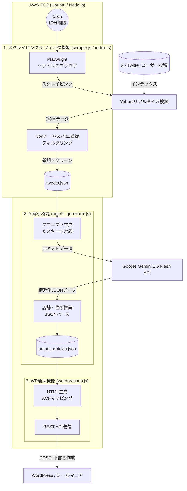

# 「シールマニア」システム（目撃情報収集）設計書

## 1. システム概要

本システムは、X（旧Twitter）上に投稿される非構造化データ（ユーザーの口コミ・目撃情報）を、Yahoo!リアルタイム検索を経由して収集し、AI（Gemini）を用いて「店舗名」「住所」「在庫状況」などの構造化データへ自動変換した上で、WordPressサイトへ自動投稿する「完全自動化メディア基盤」である。

* **目的:** 人手を介さずに、鮮度が高くSEOに強い「地域別・店舗別の在庫情報データベース」を構築・運用する。
* **想定運用体制:** 完全自動（管理者はWordPress上の下書き記事の最終確認・公開のみを行う）。

## 2. システムアーキテクチャ全体図

## 3. 各コンポーネントの役割と技術仕様

### 3.1. データ収集・フィルタリング層 (Scraper)

* **実行環境:** Node.js + Playwright
* **役割:** Yahoo!リアルタイム検索から指定キーワード（例：「ボンボンドロップ 売ってた」）を検索し、最新のツイートを抽出する。
* **主要ロジック:**
* **Bot回避:** Playwrightによるブラウザレンダリングと、User-Agentの偽装。
* **スパム排除機能 (Auto-BAN):** 転売（メルカリ等）やアフィリエイトURLを含むユーザーを検知し、メモリおよびローカルのブラックリスト(`blacklist.txt`)に登録。以降の処理から除外する。
* **重複排除:** すでに処理済みのツイートID(`tweets.json`に存在するもの)はスキップ。

### 3.2. AIデータ構造化層 (Analyzer)

* **実行環境:** Node.js + Google Generative AI SDK
* **AIモデル:** Gemini 1.5 Flash
* **役割:** ノイズの多いツイート文から、記事化に必要なファクト（店舗名、住所、商品、状況）のみを正確に抜き出す。
* **主要ロジック:**
* **住所推論:** 「イオン大宮」といった曖昧な記述から、AIの知識ベースを用いて「埼玉県さいたま市…」という正確な住所と郵便番号を補完する。
* **JSON Schema強制:** `responseMimeType: "application/json"` とスキーマ定義により、システムがパース可能な完全なJSON形式でのみ回答を出力させる。

### 3.3. コンテンツ配信層 (Publisher / CMS)

* **実行環境:** Node.js (axios) + WordPress (SWELL/Cocoon + ACF)
* **役割:** AIが整形したJSONデータを受け取り、WordPressの記事（下書き）として登録する。
* **主要ロジック:**
* **カテゴリ自動マッピング:** JSON内の「都道府県名」を、WordPressのカテゴリIDに自動変換。
* **HTML生成:** ユーザーが読みやすい装飾付きのHTML本文を自動生成（AIによる推測を含む場合は警告文を挿入）。
* **メタデータ登録:** 地図アプリ等との連携を見据え、抽出した店舗名や住所をカスタムフィールド（ACF）に格納する。
