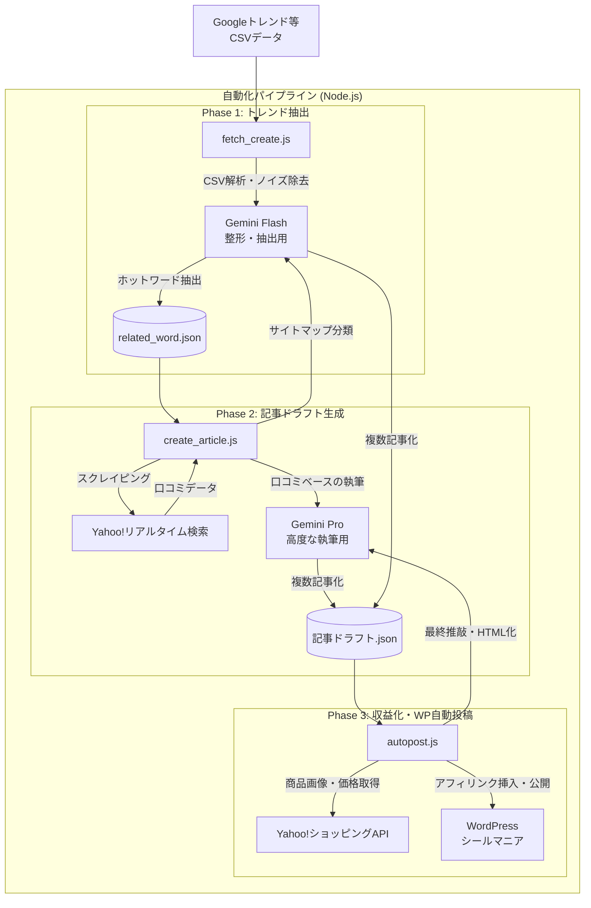

# 「シールマニア」トレンド記事自動生成システム 設計書

## 1. システム概要

本システムは、Googleトレンド等の検索クエリデータ（CSV）を起点とし、SNS上の「ユーザーの生の声」を収集・分析した上で、SEOに最適化されたブログ記事を完全自動で量産・公開するバッチ処理システムである。

単なる「AIによる自動執筆」とは異なり、**「X（Twitter）のリアルな口コミをベースにする点」「1つのキーワードから切り口の違う複数記事を生成する点」「アフィリエイトリンク（Yahoo!ショッピングAPI連携）を自動挿入する点」**において、極めて実用的かつ収益化に直結するアーキテクチャとなっている。

---

## 2. システムアーキテクチャと処理フロー

本システムは、責務が分割された3つの独立したNode.jsスクリプトで構成される「パイプライン処理」を採用している。



---

## 3. 各モジュールの機能詳細

### Phase 1: トレンドキーワード抽出モジュール (`fetch_create.js`)

* **入力:** `relatedQueries.csv`, `relatedEntities.csv` (Googleトレンド出力ファイル)
* **AIモデル:** Gemini 1.5 Flash（高速・安価な情報処理用）
* **役割:** 生の検索クエリから、「シールマニア」のメディアにとって無価値なノイズ（メルカリ、在庫、売り切れ等）を除外し、記事のテーマとなる「ホットワード」だけを抽出・結合する。
* **技術的工夫点:**
* 「単体キーワード」と「複合キーワード」が混在する場合、より具体性の高い複合キーワードを優先して残すロジック（包含関係の処理）をAIのプロンプトで制御している。


### Phase 2: 口コミ収集＆記事ドラフト生成モジュール (`create_article.js`)

* **入力:** Phase 1で生成されたホットワードのJSON
* **AIモデル:** Gemini Pro（長文執筆・推論用）および Gemini Flash（JSON整形用）
* **役割:** キーワードをもとにYahoo!リアルタイム検索をスクレイピングし、実際のユーザーの感情（可愛い、当たった等）を含む投稿を収集。それらを材料に、**1つのキーワードにつき3〜4本の「切り口が異なる記事（速報、攻略、考察など）」**のドラフトを作成する。
* **技術的工夫点:**
* **薄いAI記事の防止:** 単なるAIの知識だけでなく、最新のSNS投稿（ファクト）をインプットにすることで、リアリティのある記事を生成している。
* **自動カテゴライズ:** システム内に「サイト構成図（Site Map）」を定義し、生成した記事がWordPressのどのカテゴリ・階層に属するかをAIに自動判別させている。


### Phase 3: 収益化・WP自動公開モジュール (`autopost.js`)

* **入力:** Phase 2で生成された記事ドラフトのJSON
* **外部API:** Yahoo!ショッピングAPI V3
* **役割:** ドラフト記事をWordPressのHTML形式に最終変換し、記事の内容にマッチした「商品アフィリエイトリンク」を自動生成して、WordPressへ「公開（Publish）」ステータスでPOSTする。
* **技術的工夫点:**
* **ポチップ風UIの自動生成:** Yahoo!ショッピングAPIから商品画像と価格を取得し、Amazon・楽天・Yahooへの遷移ボタンを備えた「読者がクリックしやすい商品リンクブロック（HTML）」を動的に生成する。
* **戦略的な広告配置:** 生成されたHTMLの「上部」「中間（h2タグの切れ目）」「下部」の3箇所に自然な形で広告を自動挿入し、マネタイズを最適化している。
* **ターム（カテゴリ/タグ）の自動生成:** 存在しないタグが指定された場合、WP REST API経由で新規作成してから記事を紐付ける堅牢な作りになっている。


---

## 4. ディレクトリ・データ連携構造

処理済みのファイルには `done_` プレフィックスを付与し、二重実行を防止する堅牢なバッチ処理設計となっている。

```text
/data
├── /related_data
│   ├── /input
│   │   ├── relatedQueries.csv      (入力元：手動またはRPAで配置)
│   │   └── relatedEntities.csv
│   └── /output
│       ├── related_word_YYYY_MM_DD.json  (Phase 1 出力)
│       └── done_related_word_...json     (処理済み)
├── /tweet_row_data
│   └── /output
│       └── tweet_row_YYYY_MM_DD.json     (収集した口コミのバックアップ)
└── /article_contents
    └── /output
        ├── YYYY_MM_DD_HH.json            (Phase 2 出力：記事ドラフト)
        └── done_YYYY_MM_DD_HH.json       (Phase 3 処理完了・WP投稿済)

```
