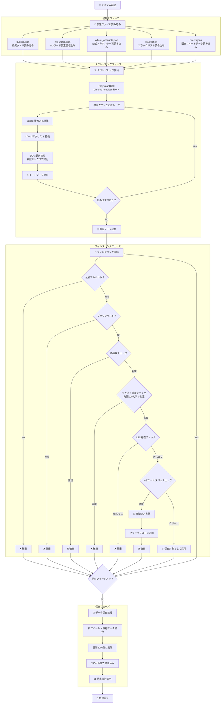

# Yahoo!リアルタイム検索 ツイート収集システム 処理フロー詳細

## システム概要
このシステムは、サンリオの公式グッズ（ボンボンドロップ、ぷっくりシール）の在庫情報をYahoo!リアルタイム検索から自動収集し、フィルタリングして保存するシステムです。

## アーキテクチャ図



## 詳細処理フロー

### 1. 初期化フェーズ (`index.js:9-18`)

| ファイル | 内容 | 例 |
|---------|------|-----|
| `queries.json` | 検索クエリ定義 | "ボンボンドロップ" (在庫 OR 入荷) -PR |
| `ng_words.json` | NGワード/URL設定 | メルカリ、amazon.co.jp/dp、アフィリエイト |
| `official_accounts.json` | 許可する公式アカウント | bonbon_drop, sanrio_official |
| `blacklist.txt` | BANされたユーザーID | user123\nspammer456 |
| `tweets.json` | 過去に保存されたツイート | [{id, text, url, ...}, ...] |

### 2. スクレイピングフェーズ (`scraper.js`)

#### 2.1 ブラウザ初期化
```javascript
// Chrome headlessモードで起動
const browser = await chromium.launch({ headless: true });
// User-Agent設定でbot検知回避
userAgent: 'Mozilla/5.0 (Windows NT 10.0; Win64; x64)...'
```

#### 2.2 検索処理
- **URL構築**: `https://search.yahoo.co.jp/realtime/search?p=${encodeURIComponent(query)}`
- **ページ遷移**: `page.goto(url, { waitUntil: 'domcontentloaded' })`
- **待機戦略**: 3秒固定待機 + DOM要素検索

#### 2.3 DOM要素検索戦略
```javascript
const possibleSelectors = [
    'div[class*="Tweet_body"]',    // Yahoo検索結果の主要セレクタ
    'div[class*="tweet"]',         // 汎用ツイートセレクタ
    'div[class*="Tweet"]',         // 大文字版
    'article',                     // HTML5 article要素
    'div[data-testid]',           // テスト用属性
    '.cnt'                        // Yahoo固有クラス
];
```

#### 2.4 データ抽出処理
各ツイートから以下の情報を抽出：
- **基本情報**: ID、ユーザーID、テキスト、URL
- **時間情報**: 投稿時刻（相対・絶対）
- **メディア**: 画像情報（src、alt、サイズ）
- **ソーシャル要素**: ハッシュタグ、メンション
- **エンゲージメント**: リプライ、RT、いいね数

### 3. フィルタリングフェーズ (`index.js:29-73`)

#### 3.1 公式アカウントフィルター
```javascript
if (!officialAccounts.includes(tweet.userId)) {
    discardedCount++;
    continue; // 公式アカウント以外は除外
}
```

#### 3.2 ブラックリストチェック
```javascript
if (isBlacklisted(tweet.userId, blacklistSet)) {
    discardedCount++;
    continue; // BANされたユーザーは除外
}
```

#### 3.3 重複チェック
- **ID重複**: `savedTweetIds.has(tweet.id)`
- **テキスト重複**: 先頭100文字のハッシュで判定

#### 3.4 URL存在チェック
```javascript
if (tweet.url === null || (Array.isArray(tweet.urls) && tweet.urls.length === 0)) {
    discardedCount++; // URLがないツイートは除外
    continue;
}
```

#### 3.5 NGワード/スパムチェック (`filters.js:14-38`)
```javascript
// テキスト内NGワードチェック
for (const ngWord of ngConfig.texts) {
    if (text.includes(ngWord)) {
        executeBan(userId, blacklistSet, `NGワード検知: ${ngWord}`);
        return true;
    }
}

// URL内スパムチェック  
for (const url of urls) {
    for (const ngUrl of ngConfig.urls) {
        if (url.includes(ngUrl)) {
            executeBan(userId, blacklistSet, `スパムURL検知: ${ngUrl}`);
            return true;
        }
    }
}
```

### 4. 自動BAN機能 (`filters.js:41-47`)
```javascript
function executeBan(userId, blacklistSet, reason) {
    if (!blacklistSet.has(userId)) {
        console.log(`🚫 [AutoBAN] User: ${userId} Reason: ${reason}`);
        blacklistSet.add(userId);     // メモリ更新
        appendToBlacklist(userId);    // ファイル追記
    }
}
```

### 5. データ保存フェーズ (`index.js:78-89`)
```javascript
// 新しいツイートを既存データの先頭に追加
const updatedTweets = [...newTweets, ...savedTweets];

// 最新2000件のみ保持（古いデータは自動削除）
const MAX_SAVE = 2000;
const trimmedTweets = updatedTweets.slice(0, MAX_SAVE);

// JSON形式で保存
saveTweets(trimmedTweets);
```

## 設定詳細

### NGワード設定例
```json
{
  "texts": [
    "メルカリ", "転売", "アフィリエイト", "招待コード",
    "相互フォロー", "ポイ活", "買取", "フリマ"
  ],
  "urls": [
    "mercari.com", "amazon.co.jp/dp", "rakuten",
    "bit.ly", "tinyurl", "amzn", "r10.to"
  ]
}
```

### 検索クエリ例
```json
[
  "\"ボンボンドロップ\" (\"入荷\" OR \"在庫\" OR \"売ってた\" OR \"買えた\") -PR -AD -Amazon -楽天 -メルカリ",
  "\"ぷっくり　シール\" (\"入荷\" OR \"在庫\" OR \"売ってた\" OR \"買えた\") -PR -AD -Amazon -楽天 -メルカリ"
]
```

## パフォーマンス統計

実行後に以下の統計が表示されます：
```
📊 Result: Scraped=45, New=8, Discarded=37, AutoBan=3
💾 Saved 1834 tweets to data/tweets.json
```

- **Scraped**: スクレイピングで取得した総ツイート数
- **New**: フィルタリング後に新規保存されたツイート数  
- **Discarded**: 各種フィルターで除外されたツイート数
- **AutoBan**: スパム検知により自動BANされたユーザー数

## セキュリティ対策

1. **Rate Limiting**: 検索間に1秒間隔を設定
2. **User-Agent偽装**: bot検知回避
3. **Headlessモード**: バックグラウンド実行
4. **自動BAN**: スパムユーザーの自動排除
5. **データ制限**: 最大2000件で容量制御